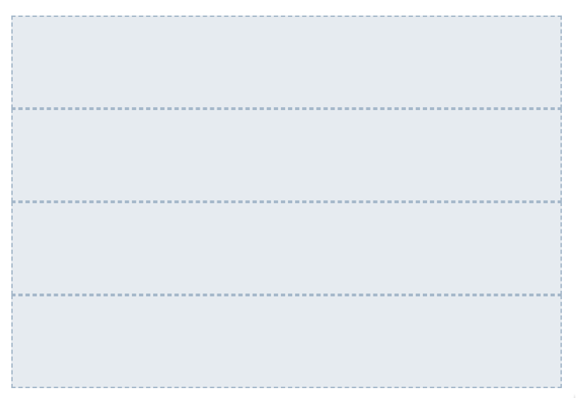
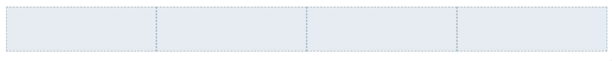

# Image Gallery

- Organize your project.

  - Create a project folder
  - within your project folder create also two further folders:

    - one for images and
    - one for your styles

- Create the basic index.html and save it under your project folder.

- Under the styles create a main.scss where only the imports are organized.

- You maybe wants to reboot your styles, to avoid that styles differs from browser to browser, due to the browser settings itself. Therefore create a `_reboot.scss` and reset the font to 'Verdana, Arial, sans-serif' and 16px.

- Further more reset all margins and paddings to 0 and set the box-sizing to border-box.

  _Keep in mind that every partial needs to be included within the main.scss._

- Store some images under your img folder, which you want to present in the image gallery.

- Know write a list where you place your gallery images in.

  - The list shouldn't contain any bulletpoints.
  - In smaller screens each list item should be placed under the one before.
  - In bigger screens (width mind. 767px) 4 list 4 items should be placed into one row.
    Use flex boxes therefore.

  Define a partial for your list and import it via the main.scss

  Viewport width < 768px:

  

  Viewport width > 767px:

  

- After that you can store the images into that items. To get it more styled instead putting only an image into the list item you can define a additional rule for an image container. You can name that rule for example `gallery-box`. Please use a partial to define the style for it.

  
  

- When hovering over the image, the image should scale a little bit. To achive this, you have to use `scale`. With `transition` you can make it even more smooth.

  https://developer.mozilla.org/en-US/docs/Web/CSS/transform-function/scale

  https://developer.mozilla.org/en-US/docs/Web/CSS/CSS_Transitions/Using_CSS_transitions

- The next thing now, is to apply different border colors for each image, when a user hovers the image.

  To get this work, you need a list in your `scss`, to define which image should have which border color.

  To define a list in `scss`is relative easy. For instance the following defines a list, which contains a number of colors:

  `$colors: (red green blue yellow);`

  It is also possible to seprate each value by a comma.

  `$colors: (red, green, blue, yellow);`

  http://sass-lang.com/documentation/file.SASS_REFERENCE.html#Lists

  What you need is a more complex list, which also contains the name of the image. To do so you need to define a list which contains an aditional list for each list item:

  `$colors: ((name1 red), (name2 green), (name3 blue), (name4 yellow));`

- After you defined this list, you have to use it within a loop.
  As you want to go through all of the list items, you can use the `@each` directive for it.

      $list: (('luca-bravo' red),('chandler-chen' green),...);
      ...

        @each $name, $color in $list {
          &[alt=#{$name}]{
           ...
          }
        }

  http://sass-lang.com/documentation/file.SASS_REFERENCE.html#_each__each-directive
